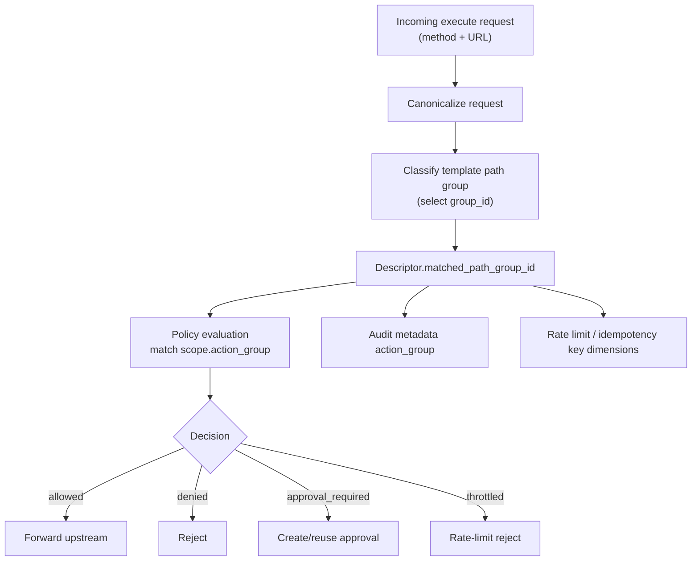

# `action_group` Concept

## What `action_group` is

`action_group` is the logical operation bucket for a request after URL/method matching.

Think of it as:

- "what kind of action is this request doing?"
- not "what exact URL is this?"

Examples:

- `openai_responses`
- `gmail_send`
- `gmail_read`

The value is used across policy evaluation, approvals, auditing, throttling, and idempotency.

## Where it comes from

`action_group` starts as the template path-group id:

- Template defines `path_groups[].group_id` in
  `/Users/dimitriskyriazopoulos/Development/brok/packages/schemas/src/generated/schemas.ts:38`
- Canonical descriptor stores the selected group as `matched_path_group_id` in
  `/Users/dimitriskyriazopoulos/Development/brok/packages/schemas/src/generated/schemas.ts:11`
- Policy rules scope against it via `scope.action_group` in
  `/Users/dimitriskyriazopoulos/Development/brok/packages/schemas/src/generated/schemas.ts:32`

So in runtime, `action_group` is effectively the normalized identity of the matched template path group.

## Are groups predefined or user-defined?

They are user/system configured in templates (not a global hardcoded enum).

- You can choose names.
- But they are not "anything goes" at runtime: they only matter if they match the request's resolved
  `matched_path_group_id`.
- A policy with an `action_group` that never matches any template path-group for a request is inert for that request.

## Why this exists

Using `action_group` instead of raw path matching in policies gives:

1. Stability: policies remain valid when low-level regex/path details evolve.
2. Security clarity: policy is attached to a reviewed action class, not ad-hoc URL fragments.
3. Better operations: audit/rate-limit/idempotency dimensions become semantic and consistent.

## Runtime flow

## How matching works

### Step 1: pick path group (classification)

Path group matching is done by iterating template `path_groups` and selecting the first method+pattern match:

- `/Users/dimitriskyriazopoulos/Development/brok/packages/policy-engine/src/classification.ts:111`

Important:

- If patterns overlap, template order matters.
- The selected group id becomes the request's `matched_path_group_id`.

### Step 2: filter policy rules by `action_group`

Policy rule scope must match descriptor `matched_path_group_id`:

- `/Users/dimitriskyriazopoulos/Development/brok/packages/policy-engine/src/evaluation.ts:153`

Then precedence is applied:

1. deny
2. allow
3. approval_required
4. template approval mode
5. default deny

Code:

- `/Users/dimitriskyriazopoulos/Development/brok/packages/policy-engine/src/evaluation.ts:378`
- `/Users/dimitriskyriazopoulos/Development/brok/packages/policy-engine/src/evaluation.ts:402`

Tie-breaking inside a rule type is deterministic:

- higher specificity first
- then lexical `policy_id`
- then insertion index

Code:

- `/Users/dimitriskyriazopoulos/Development/brok/packages/policy-engine/src/evaluation.ts:84`

## Conflict scenarios

## 1) Conflicting policies on the same action group

Example:

- Rule A: `allow` for action group `openai_chat`
- Rule B: `deny` for action group `openai_chat`

Result: `deny` wins (`policy_deny`).

## 2) Conflicting path definitions before policy stage

Example:

- Group `chat_exact`: `^/v1/chat/completions$`
- Group `chat_wild`: `^/v1/chat/.*$`

If both match the same request, classification chooses first in template order.
Only that chosen group participates in policy matching.

This is why path-group design/ordering is security-relevant.

## Where `action_group` affects behavior

1. Policy decision context and trace:
   - `/Users/dimitriskyriazopoulos/Development/brok/apps/broker-api/src/http/routes/executeRoute.ts:165`
2. Approval summary payloads:
   - `/Users/dimitriskyriazopoulos/Development/brok/packages/schemas/src/generated/schemas.ts:5`
3. Audit event indexing/filtering:
   - `/Users/dimitriskyriazopoulos/Development/brok/packages/schemas/src/generated/schemas.ts:8`
4. Rate-limit and idempotency key partitioning:
   - `/Users/dimitriskyriazopoulos/Development/brok/packages/db/README.md:224`
   - `/Users/dimitriskyriazopoulos/Development/brok/packages/db/README.md:261`

## Best practices

1. Use semantic names (`provider_operation`) rather than path-like names.
2. Avoid overlapping path patterns across groups unless intentionally ordered and documented.
3. Keep one security profile per group (risk tier, approval mode, rate limits).
4. Review every new group as a policy surface expansion.
5. Add tests when adding or reordering path groups, because this can change effective policy behavior.
