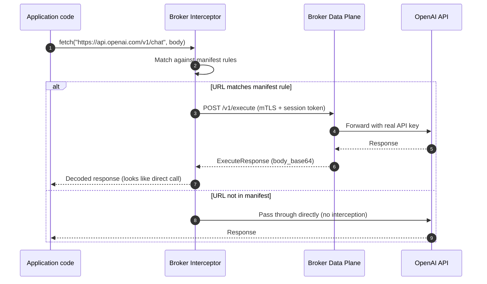

# Interceptor architecture

This document explains how a workload intercepts outgoing HTTP requests, routes them through the Broker, and returns
responses with high confidence that all target traffic is handled.

## The problem

Your workload (a Node service) needs to call external APIs (OpenAI, Gmail, etc.) but:

- The external API credentials live only in the Broker
- The Broker enforces policy and audit
- The workload should not know real credentials

The interceptor's job is to catch outgoing requests to protected hosts, rewrite them so they go through the Broker
`/v1/execute` endpoint, and return the upstream response as if it came directly from the external API.

## Interception strategies and their guarantees

### Strategy 1: base URL override (strongest guarantee)

Change the SDK or client configuration to point at the Broker instead of the real API.

```js
// OpenAI example
import OpenAI from 'openai';

const openai = new OpenAI({
  baseURL: 'https://broker.example.com/proxy/openai', // Broker rewrites this
  apiKey: 'workload-dummy-key' // Broker ignores this, injects real key
});
```

**Guarantee**: 100% of SDK calls go through the Broker because the SDK itself is configured to call the Broker.

**Limitation**: Only works for SDKs that support base URL override. Manual `fetch`/`axios` calls to the real host are
not intercepted.

---

### Strategy 2: explicit wrapper around fetch/axios (strong guarantee)

Wrap the HTTP client explicitly. The wrapper checks the manifest and rewrites matching requests.

```js
import {createBrokerFetch} from '@broker-interceptor/interceptor-node';

const brokerFetch = createBrokerFetch({
  brokerUrl: 'https://broker.example.com',
  sessionTokenProvider: () => process.env.SESSION_TOKEN,
  manifest, // signed manifest from Broker
  mtlsAgent // https.Agent with workload cert
});

// Use brokerFetch instead of global fetch
const response = await brokerFetch('https://api.openai.com/v1/chat/completions', {
  method: 'POST',
  headers: {'content-type': 'application/json'},
  body: JSON.stringify({model: 'gpt-4.1', messages: [{role: 'user', content: 'hi'}]})
});
```

**Guarantee**: 100% if all code uses `brokerFetch`. The wrapper checks the manifest match rules before deciding to
rewrite or pass through.

**Limitation**: Requires discipline. Third-party libraries that call `fetch` directly are not intercepted unless they
accept a custom fetch.

---

### Strategy 3: http/https agent injection (best-effort)

Create a custom `https.Agent` that rewrites requests at the socket level.

```js
import https from 'node:https';
import {createBrokerAgent} from '@broker-interceptor/interceptor-node';

const agent = createBrokerAgent({
  brokerUrl: 'https://broker.example.com',
  sessionTokenProvider: () => process.env.SESSION_TOKEN,
  manifest,
  workloadCert: fs.readFileSync('workload.crt'),
  workloadKey: fs.readFileSync('workload.key'),
  caCert: fs.readFileSync('ca-chain.pem')
});

// Pass agent to fetch, axios, or http module
const response = await fetch('https://api.openai.com/v1/chat/completions', {
  method: 'POST',
  agent
  // ...
});
```

**Guarantee**: Works for any code that respects the `agent` option, including `axios`, `got`, `node-fetch`, and native
`https.request`.

**Limitation**: Not all libraries respect custom agents. `undici` (Node 18+ default fetch) does not use `https.Agent` in
the same way.

---

### Strategy 4: global monkey-patching (fragile, not recommended)

Patch `globalThis.fetch` or `http.request` at process startup.

```js
import {patchGlobalFetch} from '@broker-interceptor/interceptor-node';

patchGlobalFetch({
  brokerUrl: 'https://broker.example.com'
  // ...
});

// All subsequent fetch calls are intercepted
```

**Guarantee**: Catches most calls, but breakage risk is high. Other libraries (test frameworks, tracing, etc.) may also
patch globals.

**Limitation**: Order-of-operations problems, version-specific bugs, hard to debug.

---

## Recommended approach for 100% coverage

Combine strategies 1 and 2:

1. **Configure SDKs with base URL override** whenever supported (OpenAI, Anthropic, Stripe, etc.).
2. **Use an explicit broker-aware fetch wrapper** for all manual HTTP calls.
3. **Pass the wrapper explicitly** to libraries that accept a custom fetch (e.g., `ky`, `ofetch`, some Prisma
   extensions).
4. **Do not rely on global patching** for security-critical interception.

This gives you deterministic, testable interception. The manifest is the source of truth for which hosts are protected.

---

## How the interceptor decides to rewrite

The signed manifest contains `match_rules`. Each rule specifies:

- `integration_id`
- `provider`
- `match.hosts` (e.g., `["api.openai.com"]`)
- `match.schemes` (e.g., `["https"]`)
- `match.ports` (e.g., `[443]`)
- `match.path_groups` (e.g., `["chat", "completions"]`)
- `rewrite.mode` (currently `"execute"`)

When the interceptor sees an outgoing request:

```
URL: https://api.openai.com/v1/chat/completions
```

1. Parse URL → scheme=https, host=api.openai.com, port=443, path=/v1/chat/completions
2. Find matching rule in manifest
3. If matched → rewrite to Broker `/v1/execute`
4. If not matched → pass through directly (or block, depending on policy)

---

## Rewrite flow (sequence)



---

## Interceptor SDK API sketch (Node)

```ts
// packages/interceptor-node/src/index.ts

export type InterceptorConfig = {
  brokerUrl: string;
  sessionTokenProvider: () => string | Promise<string>;
  manifestProvider: () => Manifest | Promise<Manifest>;
  mtlsCert: Buffer | string;
  mtlsKey: Buffer | string;
  mtlsCa: Buffer | string;
  onNonMatched?: 'passthrough' | 'block';
};

export function createBrokerFetch(config: InterceptorConfig): typeof fetch;

export function createBrokerHttpsAgent(config: InterceptorConfig): https.Agent;

export function createAxiosInterceptor(config: InterceptorConfig): AxiosInterceptor;

export function verifyManifestSignature(manifest: unknown, jwks: JsonWebKeySet): Manifest;
```

---

## What about 100% certainty?

You can achieve 100% certainty that protected calls go through the Broker **if and only if**:

1. The workload never has real provider credentials (only the Broker does).
2. All SDK base URLs are overridden to point at the Broker.
3. All manual HTTP code uses the explicit broker-aware wrapper.
4. The manifest defines which hosts are protected.
5. Non-matched traffic is either passed through (for non-sensitive hosts) or blocked.

If a developer writes `fetch("https://api.openai.com", ...)` without using the wrapper and without the base URL
override, that call will go direct. The Broker cannot stop it because it never sees it.

**Mitigation**: Block direct egress at the network level (firewall / iptables / k8s NetworkPolicy) so only the Broker
can reach external APIs. Then even a direct call will fail.

---

## Network-level enforcement (defense in depth)

For production, combine the interceptor with network controls:

```text
┌─────────────────────────────────────────────────────────────────┐
│ Workload pod/container                                          │
│   - Can only reach Broker (egress whitelist)                    │
│   - Cannot reach api.openai.com directly                        │
└───────────────────────────┬─────────────────────────────────────┘
                            │
                            ▼
┌─────────────────────────────────────────────────────────────────┐
│ Broker Data Plane                                               │
│   - CAN reach api.openai.com                                    │
│   - Holds real credentials                                      │
│   - Enforces policy, audit, approval                            │
└─────────────────────────────────────────────────────────────────┘
```

With this setup, even a buggy or malicious workload cannot bypass the Broker for protected hosts.

---

## Summary

| Strategy          | Coverage            | Reliability | Recommended      |
| ----------------- | ------------------- | ----------- | ---------------- |
| Base URL override | SDK calls only      | Very high   | Yes              |
| Explicit wrapper  | Calls using wrapper | Very high   | Yes              |
| Agent injection   | Calls with agent    | Medium-high | Secondary        |
| Global patching   | All fetch           | Low         | No               |
| Network firewall  | All egress          | Very high   | Yes (production) |

For 100% certainty:

1. Use SDK base URL override + explicit wrapper
2. Block direct egress at network layer
3. Validate manifest signature and TTL strictly
4. Fail closed on non-matched traffic in strict mode
