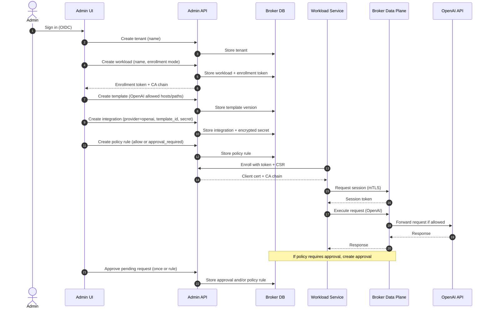

# Setup flow: first OpenAI workflow

This diagram shows the minimal sequence to get a tenant, workload, integration, policies, and approvals working
end-to-end.



## Checklist summary

1. Create a tenant.
2. Create a workload and enroll it to get a client certificate.
3. Create a template that matches OpenAI endpoints you want to allow.
4. Create an integration using the template and store the OpenAI secret.
5. Create a policy rule (allow, approval_required, or rate_limit).
6. Run the workload with mTLS, request a session, then execute calls.
7. If approvals are required, approve in the Admin UI.

## Node workload quickstart (example calls)

This assumes you already created the tenant, workload, template, integration, and policy in the Admin UI and you have:

- `WORKLOAD_ID`
- `ENROLLMENT_TOKEN`
- Admin API base URL (control plane)
- Broker API base URL (data plane)

### 1) Prepare a CSR (one-time)

Use OpenSSL to create a private key and CSR for the workload:

```bash
openssl genrsa -out workload.key 2048
openssl req -new -key workload.key -out workload.csr -subj "/CN=workload"
```

### 2) Enroll the workload (Admin API)

```js
// enroll.js
import fs from 'node:fs/promises';

const ADMIN_API_URL = process.env.ADMIN_API_URL; // e.g. https://admin-api.example.com
const WORKLOAD_ID = process.env.WORKLOAD_ID;
const ENROLLMENT_TOKEN = process.env.ENROLLMENT_TOKEN;

const csrPem = await fs.readFile('workload.csr', 'utf8');

const response = await fetch(`${ADMIN_API_URL}/v1/workloads/${encodeURIComponent(WORKLOAD_ID)}/enroll`, {
  method: 'POST',
  headers: {
    'content-type': 'application/json'
    // Add admin auth header if required for your setup.
    // authorization: `Bearer ${process.env.ADMIN_BEARER_TOKEN}`
  },
  body: JSON.stringify({
    enrollment_token: ENROLLMENT_TOKEN,
    csr_pem: csrPem,
    requested_ttl_seconds: 3600
  })
});

if (!response.ok) {
  throw new Error(`enroll failed: ${response.status}`);
}

const payload = await response.json();
await fs.writeFile('workload.crt', payload.client_cert_pem, 'utf8');
await fs.writeFile('ca-chain.pem', payload.ca_chain_pem, 'utf8');
console.log('enrolled, cert saved');
```

### 3) Request a session token (Broker API, mTLS)

```js
// session.js
import https from 'node:https';
import fs from 'node:fs/promises';

const BROKER_API_URL = process.env.BROKER_API_URL; // e.g. https://broker.example.com

const agent = new https.Agent({
  cert: await fs.readFile('workload.crt'),
  key: await fs.readFile('workload.key'),
  ca: await fs.readFile('ca-chain.pem')
});

const response = await fetch(`${BROKER_API_URL}/v1/session`, {
  method: 'POST',
  headers: {'content-type': 'application/json'},
  body: JSON.stringify({requested_ttl_seconds: 900}),
  agent
});

if (!response.ok) {
  throw new Error(`session failed: ${response.status}`);
}

const payload = await response.json();
console.log('session_token:', payload.session_token);
```

### 4) Execute an OpenAI request (Broker API)

```js
// execute.js
import https from 'node:https';
import fs from 'node:fs/promises';

const BROKER_API_URL = process.env.BROKER_API_URL;
const SESSION_TOKEN = process.env.SESSION_TOKEN;

const agent = new https.Agent({
  cert: await fs.readFile('workload.crt'),
  key: await fs.readFile('workload.key'),
  ca: await fs.readFile('ca-chain.pem')
});

const response = await fetch(`${BROKER_API_URL}/v1/execute`, {
  method: 'POST',
  headers: {
    'content-type': 'application/json',
    authorization: `Bearer ${SESSION_TOKEN}`
  },
  body: JSON.stringify({
    integration_id: process.env.INTEGRATION_ID,
    request: {
      method: 'POST',
      url: 'https://api.openai.com/v1/responses',
      headers: [{name: 'content-type', value: 'application/json'}],
      body_base64: Buffer.from(
        JSON.stringify({
          model: 'gpt-4.1-mini',
          input: 'Hello from the Broker'
        })
      ).toString('base64')
    },
    client_context: {source: 'workload-service'}
  }),
  agent
});

const payload = await response.json();
console.log(payload);
```

If the response status is `approval_required`, approve the request in the Admin UI and retry the execute call.

### Optional: fetch manifest (for workload interceptors)

```js
// manifest.js
import https from 'node:https';
import fs from 'node:fs/promises';

const BROKER_API_URL = process.env.BROKER_API_URL;
const SESSION_TOKEN = process.env.SESSION_TOKEN;
const WORKLOAD_ID = process.env.WORKLOAD_ID;

const agent = new https.Agent({
  cert: await fs.readFile('workload.crt'),
  key: await fs.readFile('workload.key'),
  ca: await fs.readFile('ca-chain.pem')
});

const response = await fetch(`${BROKER_API_URL}/v1/workloads/${encodeURIComponent(WORKLOAD_ID)}/manifest`, {
  headers: {authorization: `Bearer ${SESSION_TOKEN}`},
  agent
});

console.log(await response.json());
```

### Environment variable cheat sheet

```bash
export ADMIN_API_URL="https://admin-api.example.com"
export BROKER_API_URL="https://broker.example.com"
export WORKLOAD_ID="w_..."
export ENROLLMENT_TOKEN="et_..."
export INTEGRATION_ID="int_..."
export SESSION_TOKEN="st_..."
```
